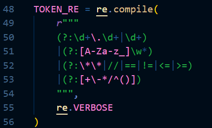
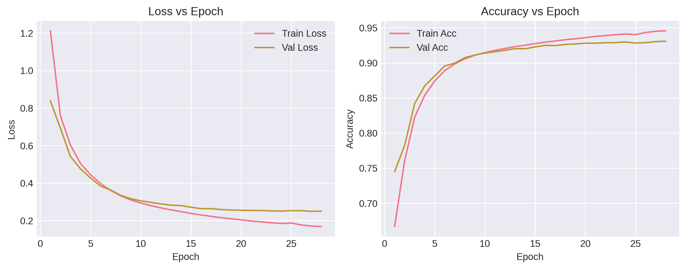
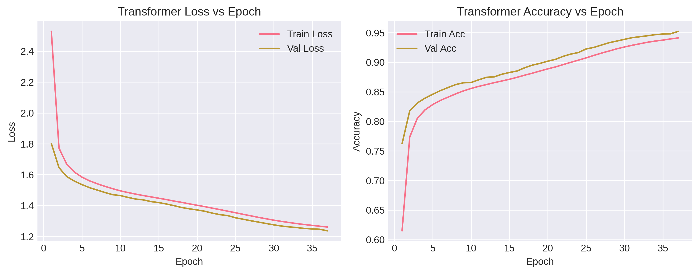

# Taylor Series Seq2Seq

## Overview

The goal of this work is to model **symbolic Taylor series expansion as a sequence-to-sequence learning problem**, where a neural network translates a mathematical function into its Taylor expansion.

---

## Key Contributions

* Generated **31,000+ symbolic function–Taylor expansion pairs** using SymPy
* Designed a **custom tokenizer for mathematical expressions** (1,582-token vocabulary)
* Implemented a **Seq2Seq LSTM model** achieving **93.08% validation accuracy**
* Implemented a **Transformer-based Seq2Seq model** achieving **95.22% validation accuracy**
* Performed **comparative analysis** of LSTM vs Transformer for symbolic learning

---

## Dataset Generation

* Functions generated using **SymPy**
* Includes:

  * Polynomial functions
  * Trigonometric functions
  * Exponential functions
* Taylor expansion computed up to **4th order**
* Generated 31,259 samples from 33,021 attempts
* A traditional method was implemented for vertification purposes.

The following diagram illustrates the data generation and representation pipeline:


## Tokenization Strategy

A **custom regex-based tokenizer** was implemented to handle symbolic expressions.

The tokenizer processes symbolic expressions into structured token sequences:

---

## Model Architectures

### 🔹 LSTM Seq2Seq

* Encoder–Decoder architecture
* Hidden size: 256
* Embedding size: 128
* Vocabulary size: 1582
* Learns sequential symbolic dependencies

### 🔹 Transformer Seq2Seq

* 4 Encoder + 4 Decoder layers with 512 dimensional feed-forward network.
* 8 attention heads and embedding size of 128.
* Captures **global symbolic relationships using self-attention**

---

## Training Details

* Optimizer: Adam
* Learning Rate: 1e-3
* Loss: CrossEntropy (ignore padding)
* Techniques used:

  * Label smoothing
  * Gradient clipping
  * Learning rate scheduling

---

## Results

### LSTM Performance

* Validation Accuracy: **93.08%**
* Training Accuracy: 94.57%
* Validation Loss: 0.2523



---

### Transformer Performance

* Validation Accuracy: **95.22%**
* Training Accuracy: 94.11%
* Validation Loss: 1.2365



---

## Key Observations

* Transformer outperforms LSTM in symbolic prediction tasks
* Self-attention enables better handling of **long-range dependencies**
* Model successfully learns the **"grammar" of Taylor expansions**
* Large vocabulary (1,582 tokens) handled effectively

---

## Repository Structure

```
src/
 ├── dataset/
 │    └── generating_dataset.py
 ├── models/
 │    ├── LSTM_model.py
 │    └── Transformer_model.py

data/
 └── taylor_tokenized_dataset.jsonl

models/
 ├── lstm_taylor_model.pth
 └── transformer_taylor_model.pth

results/
 ├── lstm_training_curves.png
 └── transformer_training_curves.png
```
